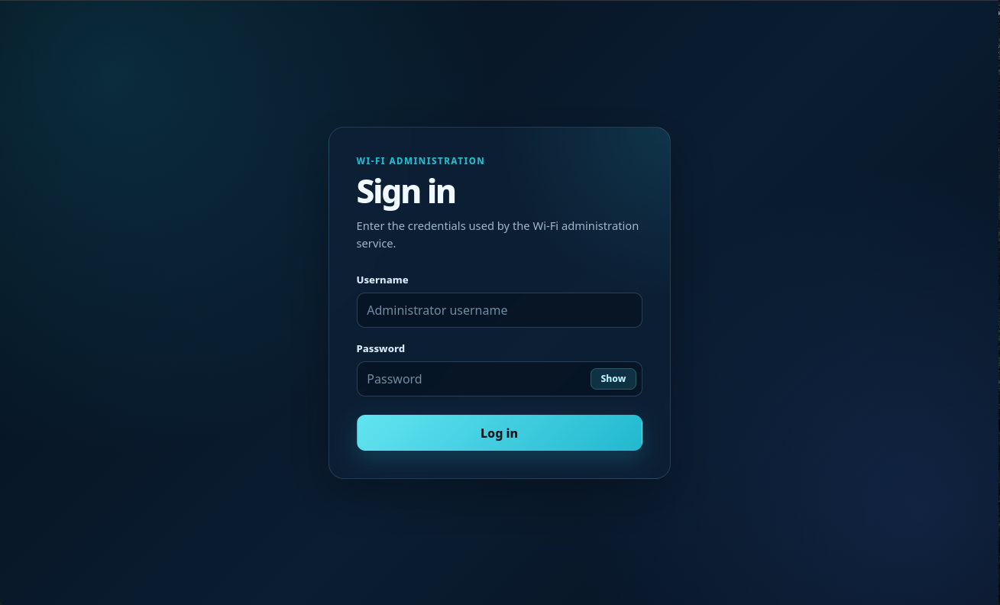
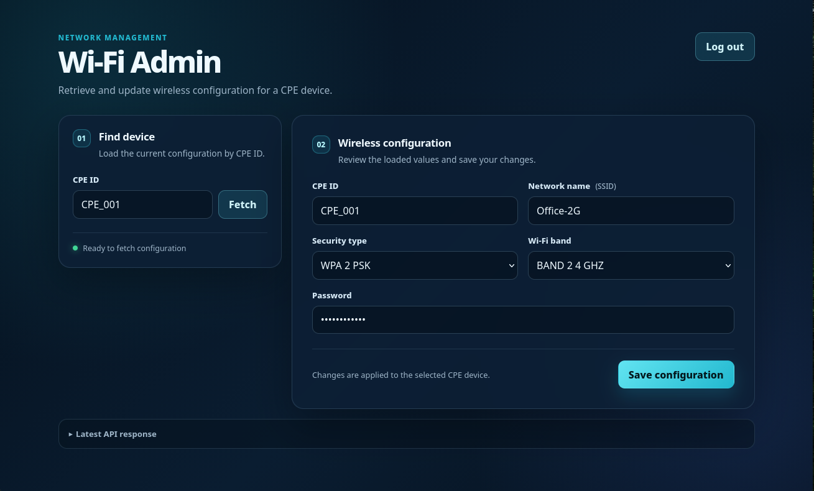
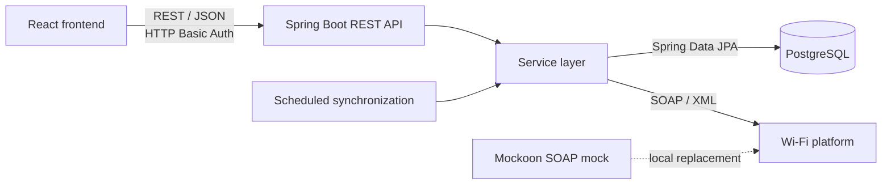

# Wi-Fi Admin

A full-stack portfolio project for retrieving and updating Wi-Fi settings on customer premises equipment (CPE).

The application demonstrates Java backend development through a Spring Boot REST API, integration with a SOAP service, PostgreSQL persistence, authentication, validation, scheduled synchronization, automated testing, and containerized local deployment.


## Screenshots

### Sign in



### Wi-Fi configuration



## Overview

Wi-Fi Admin allows an authenticated operator to:

- Find a device by its CPE identifier
- Retrieve its current wireless configuration
- Change the SSID, Wi-Fi band, encryption type, and password
- Submit the updated configuration to an external SOAP service
- Store the latest configuration in PostgreSQL

The React frontend communicates with the Spring Boot backend through JSON over HTTP. The backend translates REST requests into SOAP messages generated from a WSDL contract.

## Architecture



For read operations, the service first checks PostgreSQL. If the requested device is not stored locally, it retrieves the configuration from the SOAP platform and persists the result.

For updates, the service validates the request, sends it to the SOAP platform, and stores the returned configuration after the external update succeeds.

## Backend highlights

- Layered architecture with controller, service, client, mapper, repository, entity, configuration, and exception-handling packages
- REST endpoints for retrieving and updating Wi-Fi configuration
- SOAP integration using Spring Web Services
- Java SOAP models generated from WSDL files during the Gradle build
- PostgreSQL persistence through Spring Data JPA
- Database-first reads with SOAP fallback
- Configurable scheduled synchronization of locally known devices
- Jakarta Bean Validation and additional business validation
- Centralized exception handling
- HTTP Basic authentication with Spring Security
- Configurable CORS policy
- Health and information endpoints through Spring Boot Actuator
- Console and file-based application logging
- Unit, controller, synchronization, and persistence integration tests
- Dockerfiles and Docker Compose configuration for reproducible local deployment

## Technology stack

| Area | Technologies |
| --- | --- |
| Backend | Java 21, Spring Boot 4.1, Gradle Kotlin DSL |
| REST API | Spring MVC, JSON, Jakarta Validation |
| SOAP integration | Spring Web Services, WSDL, JAXB, Apache CXF code generation |
| Persistence | Spring Data JPA, Hibernate, PostgreSQL 16 |
| Security | Spring Security, HTTP Basic authentication |
| Operations | Spring Boot Actuator, scheduled tasks, SLF4J logging |
| Testing | JUnit 5, Spring Boot Test, MockMvc, Spring WS Test, H2 |
| Frontend | React 19, JavaScript, HTML, CSS |
| Web server | Nginx for the containerized frontend |
| Infrastructure | Docker, Docker Compose, Mockoon |

## API endpoints

All `/wifi-parameter` endpoints require HTTP Basic authentication.

| Method | Endpoint | Description |
| --- | --- | --- |
| `GET` | `/wifi-parameter/{cpeId}` | Retrieve the configuration for a device |
| `PUT` | `/wifi-parameter` | Validate and update a device configuration |
| `GET` | `/wifi-parameter/encryption-types` | List supported encryption types |
| `GET` | `/wifi-parameter/wifi-band-types` | List supported Wi-Fi bands |
| `GET` | `/actuator/health` | Check application health |
| `GET` | `/actuator/info` | Retrieve application information |

The health and information endpoints are public. Other Actuator endpoints, if enabled, require the `ADMIN` role.

## Validation rules

The backend applies both request-model and service-level validation.

Examples include:

- Secured networks must have a password
- Open networks do not retain a password
- Requests must use supported Wi-Fi bands and encryption types
- SOAP faults and missing CPE devices are translated into application-level errors

The frontend performs corresponding checks for immediate feedback, while the backend remains responsible for enforcing the rules.

## Scheduled synchronization

The backend can periodically refresh all configurations already stored in PostgreSQL.

Synchronization is configurable through application properties:

```properties
wifi.sync.enabled=true
wifi.sync.initial-delay-ms=10000
wifi.sync.fixed-delay-ms=60000
```

A failure for one device is logged without stopping synchronization of the remaining devices.

## Running with Docker

### Prerequisites

- Git
- Docker
- Docker Compose

### 1. Clone the repository

```bash
git clone [https://github.com/matejmagat/wifi-admin.git](https://github.com/matejmagat/wifi-admin.git)
cd wifi-admin
```

### 2. Create the environment file

```bash
cp .env.example .env
```

Add local values to `.env`:

```dotenv
APP_PORT=8080

ADMIN_USER=admin
ADMIN_PASSWORD=change-me

POSTGRES_DB=wifi_admin
```

The same local credentials are used for the application administrator and the PostgreSQL container.

### 3. Start the application

```bash
docker compose --profile prod up --build
```

Open the application at:

```text
http://localhost:8080
```

Sign in with the values configured as `ADMIN_USER` and `ADMIN_PASSWORD`.

### 4. Stop the application

```bash
docker compose --profile prod down
```

To also remove the PostgreSQL volume and all locally stored data:

```bash
docker compose --profile prod down -v
```

## Local development

The database and SOAP mock can run in Docker while the backend and frontend run directly on the host.

### Start supporting services

Create and complete the root `.env` file, then run:

```bash
docker compose up -d postgres mockoon
```

This starts:

- PostgreSQL on host port `5433`
- Mockoon on host port `3000`

### Run the backend

Copy the development configuration template:

```bash
cp wifi-admin-service/src/main/resources/application-dev.properties.example \
   wifi-admin-service/src/main/resources/application-dev.properties
```

Load the values from the root `.env` and define the backend environment:

```bash
set -a
source .env
set +a

export DB_URL="jdbc:postgresql://localhost:5433/${POSTGRES_DB}"
export DB_USERNAME="${ADMIN_USER}"
export DB_PASSWORD="${ADMIN_PASSWORD}"
export APP_SECURITY_USERNAME="${ADMIN_USER}"
export APP_SECURITY_PASSWORD="${ADMIN_PASSWORD}"
export APP_ALLOWED_ORIGINS="http://localhost:3001"
export SOAP_ENDPOINT="http://localhost:3000/platform"
```

Start Spring Boot:

```bash
cd wifi-admin-service
./gradlew bootRun
```

The backend runs on:

```text
http://localhost:8081
```

### Run the frontend

In `wifi-admin-frontend/.env`, configure the backend URL and a port that does not conflict with Mockoon:

```dotenv
REACT_APP_API_BASE_URL=http://localhost:8081
PORT=3001
```

Install dependencies and start the development server:

```bash
cd wifi-admin-frontend
npm install
npm start
```

Open:

```text
http://localhost:3001
```

## Testing

### Backend

Run the complete backend test suite with:

```bash
cd wifi-admin-service
./gradlew test
```

The backend test source includes:

- Application and integration tests
- Persistence integration tests using H2
- REST controller tests
- Service-layer tests
- Scheduled synchronization tests

### Frontend

Run the React tests once without watch mode:

```bash
cd wifi-admin-frontend
npm test -- --watchAll=false
```

## Repository structure

```text
.
├── docs/
│   ├── TASK.md
│   ├── login.png
│   └── main.png
├── mockoon/
│   └── platform-mock.json
├── openapi/
├── wifi-admin-frontend/
│   ├── src/
│   │   ├── api/
│   │   ├── components/
│   │   ├── hooks/
│   │   └── utils/
│   ├── Dockerfile
│   └── nginx.conf
├── wifi-admin-service/
│   ├── src/main/java/
│   ├── src/main/resources/
│   ├── src/test/java/
│   ├── build.gradle.kts
│   └── Dockerfile
├── wsdl/
├── docker-compose.yml
└── README.md
```

## Engineering decisions

### REST-to-SOAP boundary

The frontend is isolated from the external SOAP contract. It uses a conventional REST/JSON API, while the backend handles SOAP envelopes, generated contract classes, and SOAP-specific failures.

### Local persistence

PostgreSQL stores the latest known device configurations. A read checks the database first and calls the SOAP service only when no local record exists.

### Consistent updates

An update is sent to the SOAP service before the local record is changed. This prevents the database from reporting an update that the external platform rejected.

### Generated SOAP models

The Gradle build generates Java classes from the WSDL definitions. This keeps the SOAP models aligned with the service contract and avoids manually maintaining XML binding classes.

### External-service isolation

Mockoon provides a predictable local replacement for the external Wi-Fi platform. This makes the application runnable without access to the real SOAP service.

## Project scope

This repository is a portfolio and learning project rather than a production deployment.

The current authentication model uses one in-memory administrator configured through environment variables. The frontend stores the credentials in browser session storage and sends them through HTTP Basic authentication.

A production version would require additional measures such as TLS, centralized identity management, dedicated secret storage, versioned database migrations, and deployment-specific monitoring.

## Author

**Matej Magat**

- GitHub: [@matejmagat](https://github.com/matejmagat)
- LinkedIn: [matej-magat](https://www.linkedin.com/in/matej-magat/)
